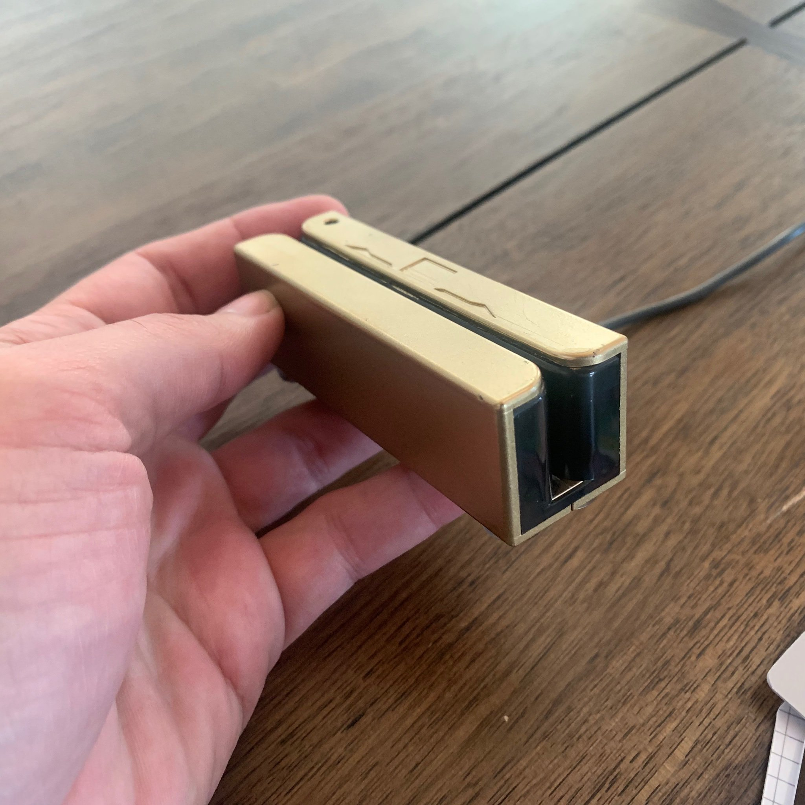
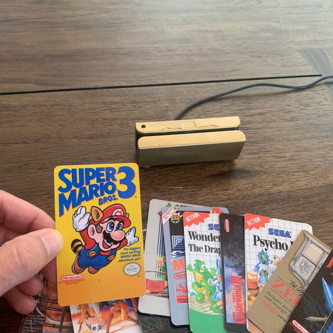
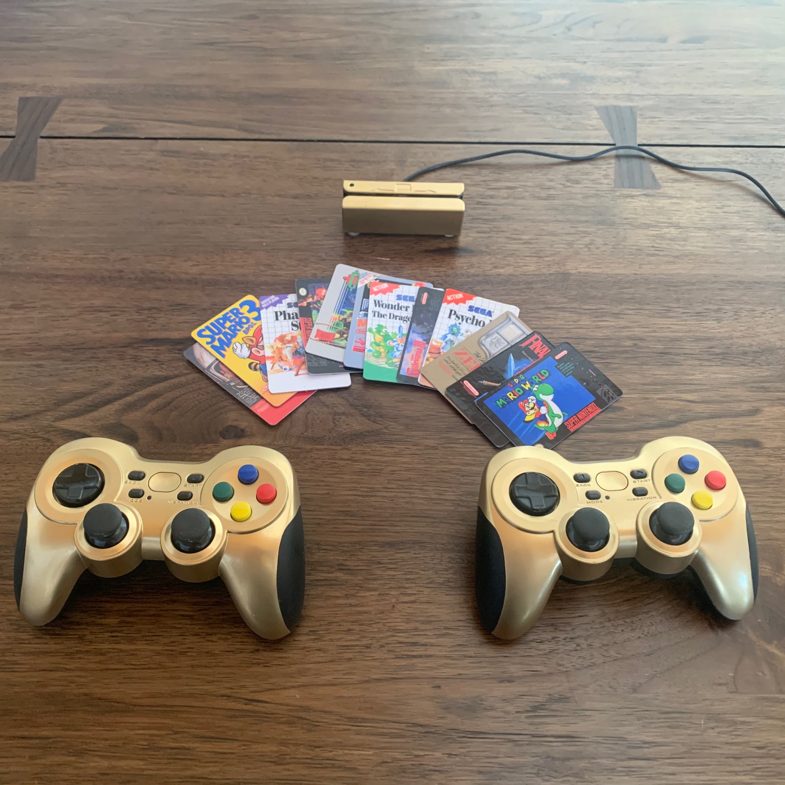
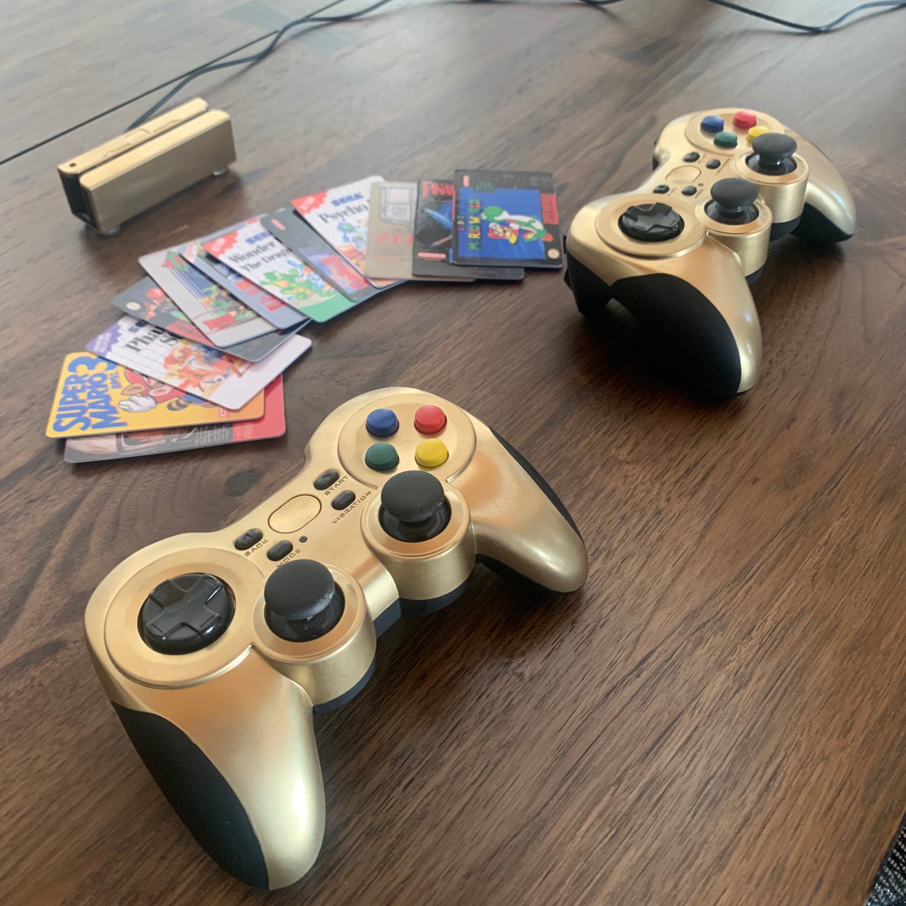

  

Card swipe game system
  
I love playing classic games but I don't love the emulator front end software. Specifically I don't love on-screen menus. 
I find joy in just grabbing a game and playing. And, I don't care about features that didn't exist with the original system. I'm sure I'm not the only one who feels this way.
  
So I made a system that loads classic games from magnetic swipe cards. 
  

  

  

